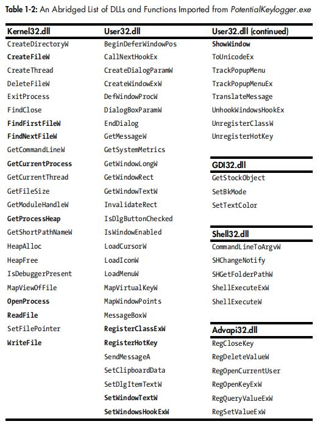

# Portable Excutable File Format

# Linked Libraries and Functions
* One of the most information of an executable is the list of functions that it **imports**. It allows us to guess what the program does;
* Code libraries can be connected to the main executable by **linking**;
* Code libraries can be linked **statically**, at runtime, or **dynamically**;
## Static, Runtime, and Dynamic Linking
* Static linking is the **least** commonly used method of linking libraries;
  * Makes the executables grow in size;
  * Difficult to differentiate between statically linked code and the executable’s own code;
* **Runtime linking** is commonly used in malware;
  * Executables that use runtime linking connect to libraries only when that function is needed;
* Several Windows functions allow programmers to import linked functions **not listed** in a program’s file header:
  * Most commonly used: LoadLibrary, GetProcAddress;
    * Can access any function in any library on the system;
  * Also used: LdrGetProcAddress, LdrLoadDll;
* **Dynamic linking** is the **most common** and the most interesting for malware analysts.
  * When libraries are dynamically linked, the host OS searches for the necessary libraries when the program is **loaded**. 
  * When the program calls the linked library function, that function executes **within the library**.

## Exploring Dynamically Linked Functions with Dependency Walker
* **DependencyWalker** program lists dynamically linked functions in an executable;
* Common DLLs:
  * Kernel32.dll: **core functionality**, such as manipulation of **memory, files, and hardware**;
  * Advapi32.dll: **advanced core Windows components** such as **Service Manager and Registry**;
  * User32.dll: **user-interface** components, such as buttons, scoll bars.
  * Gdi32.dll: displaying and manipulating **graphics**;
  * Ntdll.dll: interface to Windows kernel;
    * If an executable imports this file, means that the author intended to use functionality not available to Windows programs, such as hiding functionality or manipulating processes;
  * WSock32.dll and Ws_32.dll: networking, such as performing network-related tasks;
  * Wininet.dll: higher-level networking functions that implements such as FTP, HTTP and NTP;
* Function Naming Conventions:
  * Ex - When Microsoft updates a function and the new function is incompatible with the old one, Microsoft continues to support the old function. The new function is given the same name as the old function, with an added Ex suffix. Functions that have been significantly updated twice have two Ex suffixes in their names.

## Imported Functions
* information about specific functions used by an executable.

## Exported Functions
* DLLs and EXEs export functions to interact with other program and code. Exported functions are **most common** in DLLs;
* The **name** of exported functions provides useful information:
  * The presence of an exported function called ServiceMain tells you that the malware runs as part of a service.
  * Functions can have any name even thourgh it is same as official name;

# Static Analysis in Practice
## PotentialKeylogger.exe: An unPacked Executable

* Seeing many imports means file not packed;
* Imports:
  * Kernel32.dll:
    * Can open and manipulate processes: OpenProcess, GetCurrentProcess, GetProcessHeap;
    * Can open and manipulate files: ReadFile, CreateFile, WriteFile;
    * Search directories: FindFirstFile, FindNextFile;
  * User32.dll:
    * Has a GUI: RegisterClassEx, SetWindowText, ShowWindow;
    * Receive keyboard inputs as a spyware: SetWindowsHookEx;
    * Register a hotkey: RegisterHotKey - wheneven user presses hotkey combination, the application is notified;
  * GDI32.dll - graphic related and the program probably has a GUI;
  * Shell32.dll - the program can launch other programs;
  * Advapi32.dll:
    * the program uses registry;
    * we should search strings of registry keys;
    * string Software\Microsoft\Windows\CurrentVersion\Run, which is a registry key (commonly used by malware) that controls which programs are automatically run when Windows starts up.
* Exports:
  * LowLevelKeyboardProc - application defined or library defined **callback** function used with SetWindowsHookEx;
  * LowLevelMouseProc;
  * SetWindowsHookEx - specify which function will be called when a specific event occurs;
* Some Conclusions:
  1. it's a keylogger that use SetWindowsHookEx to record keystrokes;
  2. it has a GUI to display to a specific user;
  3. the hotkey registered with RegisterHotKey specifies the hotkey that the author use to see keylogger GUI and access recorded keystrokes;
  4. the program will load at system startup;

## PackedProgram.exe: a dead end
* Few Import list and no readable strings tells us the program is packed or obfuscated;

# The PE File Headers and Sections
## Examing PE files with PEview
* IMAGE_FILE_HEADER:
  * **Time Date Stamp** tells us when the excutable is compiled;
  * All Delphi programs use a compile time of June 19, 1992;
  * A competent malware writer can easily fake the compile time;
* IMAGE_OPTIONAL_HEADER:
  * Subsystem: indicates it's console or GUI program;
    * IMAGE_SUBSYSTEM_WINDOWS_CUI - console;
    * IMAGE_SUBSYSTEM_WINDOWS_GUI - GUI;
* IMAGE_SECTION_HEADER:
  * If **Virtual Size** is much larger than **Size of Raw Data**, it's indicative of packed code especially .text section is larger in memory than on disk;
  * But it is normal that for .data that Virtual Size is larger than Size of Raw Data;

## Viewing the Resource Section with Resource Hacker

## Using Other PE Tools

