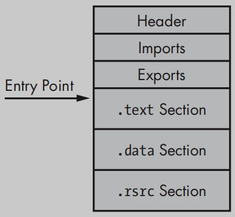
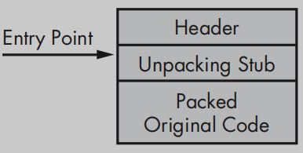
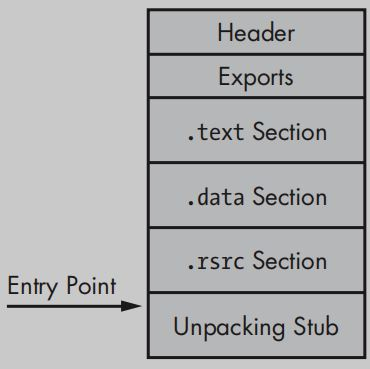

* 2 main reasons of packers: 
  * shrink the size.
  * thrawt analysis or detection.

# Packer Anatomy
* all packers takes an executable as an input and produce an executable file as output.
## The Unpacking Stub
* Nonpacked exe is loaded by OS.
* With packed program, unpacking stub is loaded by OS and then unpacking stub loads the original program.
  * the original program is generally stored in one or more extra sections of the file.
* unpacking stub performs 3 steps:
  * unpack original executable into memory.
  * resolve all the imports of original executable.
  * transfer execution to original entry point (OEP).
## Loading the Executable
* When regular exe loads:
  * a loader reads PE header on the disk and allocates memory for each exe's sections based on PE header.
  * the loader copies the sections into the allocated spaces in memory.
* packed exe formats the PE header to allocate space for sections, or the unpacking stub creates the sections.
  * unpacking stub unpacks code of each section and copies to the allocated space.
## Resolving Imports
* unpacking stub will resolve imports. 
  * 1st approach:the most common approach is to have unpacking stub only import LoadLibrary and GetProcAddress functions.
    * after unpacking stub unpacks the original exe, it reads the imports information.
    * it will call **LoadLibrary** to load DLL into memory and use **GetProcAddress** to get each function address.
  * 2nd approach is to keep original import table intact. But this approach lacks stealth.
  * 3rd approach is to keep one import function from each DLL contained in original import table. But unpacking stub still need resolve most of functions imported.
  * 4th approach is to remove all imported functions. Packer must find all functions needed from other libraries without using functions, or it must find LoadLibrary and GetProcAddress. It's stealthy but the unpacking stub is complex.
## The Tail Jump
* Once unpacking stub is complete, it will transfer execution to OEP with JMP.
* some packers also use CALL or RET. sometimes the tail jump is obscured with OS functions to transfer control, such as NtContinue or ZwContinue.
## Unpacking Illustrated
* packing and unpacking process:
  * original exe:
  
  * packed exe on disk:
  
  * unpacked and loaded into memory but before building import table:
  
  * fully unpacked with import table built:
  

# Identifying Packed Programs
## Indicators of a Packed Program
* few imports or the only imports are LoadLibrary and GetProcAddress.
* when load in IDA, only a small amounnt of code are recognized.
* when load in OD, there's a warning that the program is packed.
* the section name shows a particular packer.
* the program has an abnormal sections sizes, such as Size of Raw Data = 0 but Virtual Size != 0.
## Entropy Calculation
* packed exe can be detected by **entropy calculation**, which is a measure of disorder in a system or program.
  * high entropy means compressed or encypted or random data.
  * low entropy means no packer.

# Unpacking Options
* automated static unpacking.
* automated dynamic unpacking.
* manual dynamic unpacking.

# Automated Unpacking
* **automated static unpacking programs** can decrypt or decompress exe.
  * retores exe to its original state.
  * designed specific to a single packer.
  * examples: PE Explorter.
* **automated dynamic unpacking programs** run the exe and allow the unpacking stub to unpack the original exe code.
* the automated unpacking program must determine where the unpacking stub ends and the original exe begins.
* Automated dynamic unpacking programs run the malicious executable, and automated static unpacking programs do not.

# Manual Unpacking
* 2 common approaches to manual unpack:
  * discover packing algorithm and write a program to reverse it.
  * run the unpacking stub, dump the process memory out, and manually fix up the PE header.
* OllyDump:
  * can dump the memory of current process.
  * can search for the OEP for a packed exe.
* Steps using OllyDump:
  * unpack and find OEP: Plugins - OllyDump - Find OEP by Section Hop.
  * after the code is unpacked into memory by OllyDump, the remaining step is to modify PE header.
  * write down OEP and keep OD open.
  * dump exe: Plugins - OllyDump - Dump Debugged Process.
  * PE header correction: reconstruct import table, redirect to real OEP of PE header.
    * OD will perform automatically.
  * click 'Dump' to finish unpacking.
## Rebuilding the Import Table with Import Reconstructor
* use Import Reconstructor (ImpRec) to rebuild import table.
  * select packed exe -> enter OEP RVA -> click IAT autosearch -> click GetImports -> click 'Fix Dump'.
## Finding the OEP
* 4 kinds of breakpoints from OllyDbg:
  * INT3 BP.
  * memory bp provided by OD.
  * hardware bp.
  * run tracing with break conditions.
### Using Automated Tools to Find the OEP
* the most commonly used tool - OllyDump.
* how it works: the unpacking stub is in one section while the exe is packed into another section. OD detects when there's a transfer from one section to another. If a call does not return, OD will not locate OEP.
### Finding the OEP Manually
* simplest manual method is to **look for the tail jump**.
* often the tail jump instruction is the **last valid instruction** before a bunch of invalid instructions.
* sample of tail jump:
  ```
    00416C31 PUSH EDI
    00416C32 CALL EBP
    00416C34 POP EAX
    00416C35 POPAD
    00416C36 LEA EAX,DWORD PTR SS:[ESP-80]
    00416C3A PUSH 0
    00416C3C CMP ESP,EAX
    00416C3E JNZ SHORT Sample84.00416C3A
    00416C40 SUB ESP,-80
    00416C43 JMP Sample84.00401000  // tail jmp
    00416C48 DB 00
    00416C49 DB 00
    00416C4A DB 00
    00416C4B DB 00
    00416C4C DB 00
    00416C4D DB 00
    00416C4E DB 00
  ```
  * reasons of tail jmp:
    * located at the end of code.
    * links to address very far.
* another way to find OEP: set read bp on **1st pushed address**.
  * unpacking stub starts with a 'push' instruction. 
  * set bp on the pushed address which can be hardware read bp or OD memory bp.
    * must view stack address in memory dump window to set bp.
  * then other data will be push above the initial pushed address.
  * when the pushed address is poped, then the tail jmp is just after the pop instruction.
* another strategy is to set bp **after each loop**.
  * takes longer time but easy to comprehend.
* another strategy is to set bp on **GetProcAddress**.
  * most malware uses GetProcAddress to resolve the imports for original function.
  * this approach allows to bypass the beginning of unpacking stub.
* another approach is to set bp on **a function that you know the original program will call**. Then work backward to find such as push ebp, mov ebp, esp.
  * for command-line program, the malware will call GetVersion and GetCommandLineA very early in the process. So can set bp on the 1st instruction of GetVersion as an example.
  * for GUI program, GetModuleHandleA is usually the first function to be called.
* another approach is to use Run Trace option in OllyDbg.
  * Run Trace will give a number of bp options.
## Repair Imports Table Manually
* the imports table is 2 tables in memory:
  * list of names or ordinals used by the loader or unpacking stub to determine which functions are needed.
  * list of addresses of all functions imported.
* when code is running, only 2nd table is needed.
* packer could remove lists of names to thwart analysis. So need to rebuild the table.
* approaches to rebuild import table:
  * simplest way is to repair import function one at a time as you encounter them in disassembly.
    * find unknown import functions in IDA:
    ```
        push eax
        call dword_401244
        ...
        dword_401244: 0x7c4586c8
    ```
    * use 0x7c4586c8 to find it in OllyDbg. OD labeled it WriteFile.
    * go back to IDA to label it imp_WriteFile.
  * manually rebuild import table.
    * time-consuming.

# Tips and Tricks for Common Packers
## UPX
* the most commonly used packer - UPX is designed for performance instead of security.
* most UPX packer can be decompressed with UPX tool with **-d option** on command line.
* some malware is also packed with UPX then packed with another packer, or packed with modified UPX.
* dump file and reconstruct the import table with **OllyDump** will be successful.
## PECompact
* PECompact is designed for speed and performance.
* difficult to unpack because of anti-debugging exceptions and obfuscated code.
* when unpack, need to set OllyDbg to pass exceptions to the program.
* you can see tail jump as jmp eax followed by 0x00.
## ASPack
* ASPack focused on security and uses self-modifying code which make it difficult to set bp and to analyze.
* setting bp on ASPack can cause malware terminate, but can still use hardware bp set on stack address.
* how to unpack manually?
  * early in code, there's pushad instruction. then set hardware read bp on one of the pushed addresses.
## Petite
* Petite uses anti-debugging mechanisms and single step exceptions.
* how to unpack?
  * use hardware bp on stack.
* Petite also keeps at least one import from each library in original import table.
## WinUpack
* WinUpack is designed for optimal compression, not for security.
* sample of tail jmp:
```
    010103A6 POP ECX
    010103A7 OR ECX,ECX
    010103A9 MOV DWORD PTR SS:[EBP+3A8],EAX
    010103AF POPAD
    010103B0 JNZ SHORT Sample_upac.010103BA
    010103B2 MOV EAX,1
    010103B7 RETN 0C
    010103BA PUSH Sample_upac.01005F85
    010103BF RETN                       // tail jmp
    010103C0 MOV EAX,DWORD PTR SS:[EBP+426]
    010103C6 LEA ECX,DWORD PTR SS:[EBP+43B]
    010103CC PUSH ECX
    010103CD PUSH EAX
    010103CE CALL DWORD PTR SS:[EBP+F49]
    010103D4 MOV DWORD PTR SS:[EBP+555],EAX
    010103DA LEA EAX,DWORD PTR SS:[EBP+447]
    010103E0 PUSH EAX
    010103E1 CALL DWORD PTR SS:[EBP+F51]
    010103E7 MOV DWORD PTR SS:[EBP+42A],EAX
```
* how to unpack?
  * set bp on GetProcAddress. simple step and find loops that set imports resolution.
  * set bp on GetModuleHandle for GUI program and GetCommandLineA for command-line program.
* sometimes WinUpack will crash OllyDbg.
## Themida
* Themida is a complicated packer with anti-debugger and anti-analysis.
* how to unpack?
  * use ProcDump to dump process from memory without debugging.

# Analyzing Without Fully Unpacking
* the simplest case: a program is unpacked fails to execute because cannot completely repair the import table and PE header.
  * can use IDA to analyze specific sections of code.
  * can run Strings to see imported functions and other useful information.
* some unpackers only unpack portion of original program. Then run the program and meet another portion to unpack then unpack. 

# Packed DLLs
* complications handling DLLs:
  * export table.
* DLL has a OEP (DllMain).
* OllyDbg can use loadDll.exe to load DLL.
* To avoid DllMain automatically executed before loading into OllyDbg. We need to change value of offset 0x2000 in Characteristics field of IMAGE_FILE_HEADER from 1 to 0. The file will be interpreted as an executable.