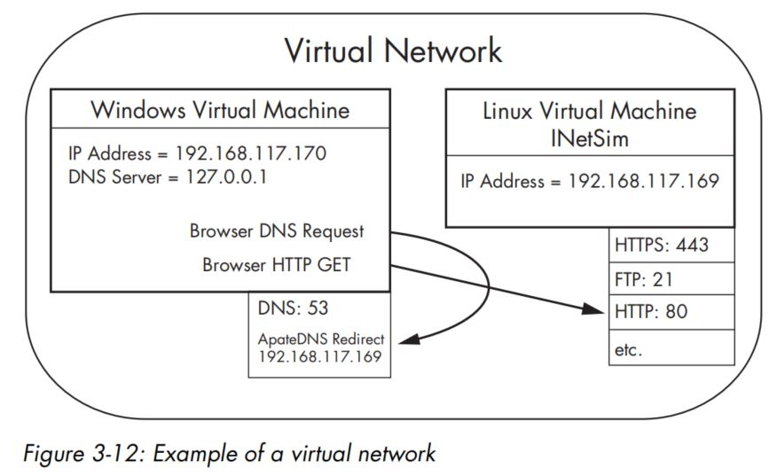

# Sandboes: Quick and Dirty Approach
* A sandbox is a security mechanism for running untrusted programs in a safe environment without harming real system;
## Using a Malware Sandbox
* Most popular sandbox - Norman Sandbox, GFI Sandbox;
## Sandbox Drawbacks
* Sandbox runs the executables without command options;
* Sandbox cannot record all events;
* Malware often detects virtual environment;
* Some Malware often requires certain registry keys or files which is not in sandbox;
* If Malware is a DLL, certain exported functions will not invoked;
* Sandbox OS may not be correct for Malware;

# Running Malware
1. For DLL, command: rundll32.exe DLLname, Export arguments
    * Export arguments - a function name or ordinal number on Exported Function Table;
    * Examples: rundll32.exe rip.dll, Install / rundll32.exe rip.dll, #5
    * PEview or PE explorer to see Explorer Function Table;
2. Malicious DLL runs most of the code in DLLMain and DLLMain is executed whenever the DLL is loaded. Can get DLLMain run by forcing DLL to load using rundll32.exe;
3. Turn DLL into EXE:
    * Wipe IMAGE_FILE_DLL (0x2000) flags from Characteristics of IMAGE_FILE_HEADER;
    * Change extension to 'exe';
    * It will run the DLLMain but it will cause Malware to crash or terminate unexpectedly;
4. DLL malware may also need to be installed as a service, sometimes with an export such as InstallService:
    * Example: 
        * rundll32.exe ipr32x.dll, InstallService ServiceName
        * net start ServiceName - 'net start' = start a service on windows;
    * If there's no exported function (InstallService), may need manually install the service by using 'sc' command or modifying registry for an unused service. Then use 'net start' on that service.
        * Registry service entry - HKLM\SYSTEM\CurrentControlSet\Services.
    
# Monitoring with **Process Monitor**
* Process Monitor - monitor certain registry, file system, network, process, and thread activity.
* Stop ProcMon from capturing events - 'File -> Capture Events'.
* Clear current display - 'Edit -> Clear Display'.
## Procmon Display
## Filtering in Procmon
* Filter -> Filter;
* Filter categories: Registry, File system, Process activity, Network;

# Viewing Process with **Process Explorer**
* Process Explorer:
  * Provide valuable insight into processes currently running on a system.
  * List all active processes, DLL loaded by a process, various process property, and overall system information.
  * Kill a process, logout users, and launch and validate processes.
## Process Explorer Display
* Using 'verify' option to verify whether it is **Microsoft signed binary**.
  * Useless when attacker uses **process replacement**. Process replacement provides Malware with the same privileges as the process it is replacing. But it leaves a fingerprint: the image in memory is different from the image on disk.
## Comparing Strings
* One way to recognize **Process Replacement**:
  * Use 'Strings' tab in Process Properties windows to compare strings in the **disk** executable against in **memory**. If drastically different, Process Replacement may happen.
## Using Dependency Walker
## Analyze Malicious Documents
* Open Process Explorer then open suspected malicious document.
* If document launches any process, you should see it in Process Explorer.
* Locate it by image tab of Property window.

# Comparing Registry Snapshots with 
* Take 1st shot, then run Malware, take 2nd shot. Click 'Compare'.

# Faking a Network
## Using ApateDNS
* ApateDNS - see DNS requests made by Malware.
## Monitoring with Netcat
* Used inbound and outbound connections for port scanning, tunneling, proxying, port forwarding and much more.
  * In listen mode, Netcat acts as a server.
  * In connect mode, Netcat acts as a client.
* Malware frequently uses port 80 or 443.
* Command Example:
  * nc -l -p 80
  * -l means listen.
  * -p specifies the port on which to listen.

# Packet Sniffing with **Wireshark**
* Wireshark - a packet capture tool that intercepts and logs network traffic.
  
# Using INetSim
* Simulating common Internet services. Best tool to provide fake services. It's Linux based tool.
* How to use? - Install INetSim on Linux based virtual machines and set it up on the same virtual network as your malware analysis virtual machines.
* How to install on Ubuntu - command: sudo apt install inetsim

# Basic Dynamic Tools in Practice
* Working Processes:
  1. Run **Procmon** and set a filter on Malware executable name. Clear all event before run Malware.
  2. Start **Process Explorer**.
  3. Gather a first snapshot of the registry using **Regshot**.
  4. Set up virtual network using **INetSim** and **ApateDNS**.
  5. Set up network traffic logging using **Wireshark**.

* Structure：
  * Contains 2 hosts: Malware analysis Windows virtual machine, Linux virtual machine running INetSim.
  * Linux virtual machine is listenning to many ports through INetSim: HTTPS(443), FTP(21), HTTP(80) and etc.
  * Windows VM is listenning to port 53 (DNS requests) through ApateDNS.
    * DNS server for Windows VM is configured to 127.0.0.1
    * ApateDNS is configured to redirect to Linux VM (192.168.117.169)
* Working Process:
  0. Complete initial setup, run Malware on VM. Then we stop event capture with **procmon** and run 2nd snapshot with **Regshot**.
  1. Use **ApateDNS** to check if DNS is performed.
  2. Review procmon result.
  3. Compare 2 Regshot snapshots.
  4. Use **Process Explorer** to examine process.
  5. Review **INetSim** logs for requests and attempted connections for standard services.
  6. Review **Wireshark** capture for network traffic generated by Malware.