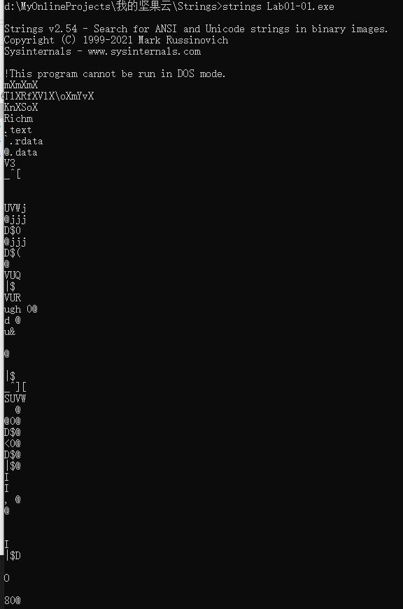

# Lab 1-1:
1. Lab01-01.exe: 48/70, Lab01-01.dll: 41/68;
2. Lab01-01.exe: 2010/12/19 16:16:19 UTC, Lab01-01.dll: 41/68: 2010/12/19 16:16:38 UTC;
3. There's no indicators that the files are packed or obfuscated.
   * PEid shows the 2 files are compiled by VC6.0;
   * Virtual Size and Size of Raw Data are close;
     * For dll, virtual size = 0x39E, size of raw data = 0x1000;
     * For exe, virtual size = 0x970, size of raw data = 0x1000;
   * Using Strings.exe to findout strings of the 2 files, there are plenty of strings which means no pack.
  
4. Check with dependencies tool.
* CreateFile, FindNextFile, FindFirstFile, CopyFile;
* CreateProcess, Sleep; - Commonly used as **backdoors**.
5. Check strings and find: C:\windows\system32\kerne132.dll. It should be kernel32 not kerne132.

6. 
* IP address as string - 127.26.152.13;

Analyze:
* Almost same compile (Time Date Stamp) time -> 2 files belong to one package;
* No packed;
* FindNextFile, FindFirstFile, CopyFile -> the Malware searches the filesystem and modifies files;
* '.exe' string -> the Malware searches executables;
* 'C:\windows\system32\kerne**1**32.dll' -> the Malware disguise itself as system file;
* CreateProcess, Sleep -> indicates Backdoors;

# Lab 1-2:
## virustotal:
* 52/67: 52 security vendors and no sandboxes flagged this file as malicious;
* MD5	8363436878404da0ae3e46991e355b83;
* SHA-1	5a016facbcb77e2009a01ea5c67b39af209c3fcb;
* SHA-256	c876a332d7dd8da331cb8eee7ab7bf32752834d4b2b54eaa362674a2a48f64a6;
* Creation Time	2011-01-19 16:10:41 UTC;
## Strings:
* UPX0 UPX1 UPX2;
* MalService;
* SystemTimeToFile;
* LoadLibrary GetProcAddress - **Packed?**
* VirtualProtect VirtualAlloc VirtualFree;
* InternetOpen - **start of Internet Access Functionality**;
## PEID
* No information - **Packed?**;
## Dependencies
* LoadLibrary GetProcAddress - **Packed?**;
* VirtualProtect VirtualAlloc VirtualFree **change a read-only section of memory to an executable?**;
* InternetOpen - **start of Internet Access Functionality**;
## PEview
* **Packed**;

1. Yes;
2. Packed with UPX. Command: upx -d lab01-02.exe;
3. 
* VirtualProtect VirtualAlloc VirtualFree **change a read-only section of memory to an executable?**;
* InternetOpen - **start of Internet Access Functionality**;
* InternetReadFile - Read data from a previously opened URL;
* InternetWriteFile - Write data to a previously opened URL;
* InternetOpenUrl - Open a specific URL for a connection using FTP, HTTP or HTTPS;
* CreateService - Create a service that can be started at boot time. Malware uses CreateService for persistence, stealth to load kernel drivers.
* StartServiceCtrlDispatch - Used by a service to connect the main thread of the process to the SCM (service control manager). Any process that runs as a service must call this function within 30 seconds of startup. Locating this function in Malmare tells that this function should run as a service.
* OpenSCManager - Open a handle to the **service control manager**;
* CreateMutex, OpenMutex - Check if only open one Malware instance;
4. http://www.malwareanalysisbook.com

## Analyze:
* Internet access http://www.malwareanalysisbook.com and exchange data;
* Allocate disk space and write memory and change Memory Protection to an executable;
* The Malware will run as a service when system bootup;
* Only one instance of the Malware can be on system;
* Packed with UPS;

# Lab 1-3
## virustotal
* 60/69: 60 security vendors and no sandboxes flagged this file as malicious;
* Jiangmin- Spyware;
* SentinelOne (Static ML) - Mal/Packer;
* MD5	9c5c27494c28ed0b14853b346b113145
* SHA-1	290ab6f431f46547db2628c494ce615d6061ceb8
* SHA-256	7983a582939924c70e3da2da80fd3352ebc90de7b8c4c427d484ff4f050f0aec
* PEiD packer	FSG v1.00 (Eng) -> dulek/xt
## Strings
* CANNOT UNPACK!!!

# Lab 1-4
## virustotal
* 56 security vendors and 1 sandbox flagged this file as malicious;
* TrojanDownloader;
* Packer;
* MD5 625ac05fd47adc3c63700c3b30de79ab 
* SHA-1 9369d80106dd245938996e245340a3c6f17587fe 
* SHA-256 0fa1498340fca6c562cfa389ad3e93395f44c72fd128d7ba08579a69aaf3b126
* Compilation Timestamp 2019-08-30 22:26:59 UTC - **FAKED**

## Strings
* CloseHandle OpenProcess GetCurrentProcess EnumProcesses CreateRemoteThread GetProcAddress LoadLibraryA
  * Control Process;
  * Process Injection?
* WinExec - Execute another program;
* WriteFile CreateFileA GetWindowsDirectoryA MoveFileA GetTempPathA
  * File system control;
* SizeofResource LoadResource FindResourceA - Resources control;
* AdjustTokenPrivileges LookupPrivilegeValueA OpenProcessToken SeDebugPrivilege
  * Change Process Privilege level;
* EnumProcessModules GetModuleBaseNameA GetModuleHandleA
  * DLL Injection?
* http://www.practicalmalwareanalysis.com/updater.exe URLDownloadToFileA
  * downloader?

## Detect Packer
* PEID - no Packer;
* Strings - lots of strings;
* Dependencies - IAT is full;
* PEview - virtualsize = 720, sizeofRawData = 1000;

## Dependencies - similar to Strings

## Analyze
* Downloader - http://www.practicalmalwareanalysis.com/updater.exe;
* Go through File System, create file, move file, copy file to a specific place - \system32\wupdmgr.exe;
* Process manupulation - protection, write memory, etc;
* Resource manupulation;
* download code first, Inject code to target process and execute;

## Result
* Malware1 get Malware2 from resouces part into memory and execute Malware2;
* Malware2 download(URLdownloadToFile) Malware3 from http://www.practicalmalwareanalysis.com/updater.exe and store as \system32\wupdmgr.exe;
* Execute Malware3(Winexc);